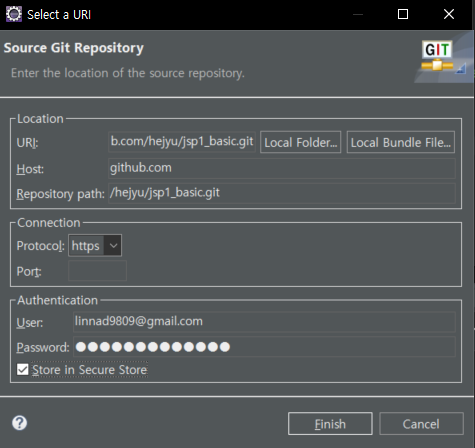

# `HTML` `CSS` `Javascript` 수업 내용

## 서버-클라이언트

- 웹서버: 정적 HTML 페이지 요청에 응답하기 위한 서버
- 웹애플리케이션 서버: 정적 HTML 페이지 + 동적인 요청(DB 서버 사용자 조회, 저장 등)에 응답 가능한 서버

### HTTP 프로토콜
- 에러 코드
    - HTTP Status 404 – Not Found : 서버 url 을 찾을 수 없을 때 발생
        
        **에러 원인**
        1. 권한 부족 
        2. 서버 자체에서 오류가 발생한 경우 리소스 반환이 안되는 경우
        3. 리다이렉션(페이지 이동 설정) 오류
        4. 리소스가 서버에 존재하지 않는 경우
        5. URL 오류 : 오타, directory 파일 이름 등 확인 

### 동적 웹애플리케이션의 구조

### 개발환경 Eclipse 셋팅

1. 작업 공간 workspace 생성
2. 이클립스 실행: eclipse.exe
    - 이클립스 인코딩: ISO-10646/Unicode(UTF-8) 셋팅
        - Window > Preference > General > Workspace
        - Window > Preference > Web: HTML, CSS, JSP Files
3. 웹 애플리케이션 서버(WAS) 설정 순서
    - Apache Tomcat 9.0 추가
        1. WAS 생성하는 순서
            1. Server 뷰(View)로 가기
            2. 새 서버 추가: 마우스 오른쪽 버튼 클릭 > New > Server
            3. 서버 유형 선택: 'Server type' 서버 타입 선택 창 > Apache 카테고리 선택 > Tomcat v9.0 Server 선택 > Next 클릭
            4. 서버 실행환경 셋팅
                - Server's host name: 웹애플리케이션을 테스트하기 위한 주소를 입력 ex) localhost
                - Server name: 식별 가능한 서버의 이름을 입력
                - Server location: Apache Tomcat 설치 경로를 설정
                    - JRE(Java Runtime Environment) 선택: 서버가 사용할 JRE를 선택 (보통 이클립스 기본 JRE 선택)
            5. 서버 추가 완료
            6. 웹애플리케이션 서버(Apache Tomcat) 실행
                - Server 뷰 > 서버 선택 > 'Start the server' 버튼을 클릭
            7. 실행 중인 웹애플리케이션 확인
                - 브라우저 > 'http://localhost:포트번호/' 접속
                - Apache Tomcat 서버에서 실행 중인 웹 애플리케이션 확인

### `lombok.jar` 실행 파일 경로 Eclipse 에 셋팅 
1. 프로젝트 directory 마우스 오른쪽 클릭 > Build Path > Configure Build Path
2. Libriaries 창 Modulepath, Classpath 중 Classpath 선택

    **Classpath 와 Modulepath 개념** 
    - Modulepath : 무조건 하나의 모듈(`프로젝트`)에
    - Classpath : 

4. 서버를 사용하는 동적 웹프로젝트 생성
                    
    **현재 perspective(상단 우측 아이콘) 가 Java EE 상태인지 확인**

    1. File > New > Dynamic Web Project 클릭 
    2. Project name : 프로젝트 이름 입력

5. 데이터베이스 연결

    **Perspective : Data Source Explorer**

    1. Database Connection > New 클릭 > Connection Profile : Oracle 선택
        - database name : websecurity
        - describe 입력 선택
    2. Driver Profile / Connection Detail : 드라이버 추가 (아이콘) 클릭
        - Name/Type : Oracle 11 
        - Jar List : 기존 ojdbc 제거 > ojdbc11.jar 추가 
        - Properties
            - Database Name : xe
            - password : 1234
            - User Id : c##idev
            - Host : localhost
    3. Test Connection 클릭

    

### 동적 웹 프로젝트 폴더 구조
    src >   main  > java : java 파일
            webapp : html, css, js, jsp 파일, 외부 라이브러리(jar)   
                ㄴ 정적 자원 : html,css, js, 이미지   => assets 폴더에 저장 
                ㄴ 동적 자원 : jsp   
                ㄴ 웹용 라이브러리 : WEB-INF > lib => ojdbc.jar, lombok.jar

### JSP (Java Server Page)
- 발전 순서 : applet(애블릿) > servlet(서블릿) > JSP
- html 파일에 필요한 부분에만 자바를 쓸 수 있고 변수 출력 등을 출력할 수 있다  
- <% %> : 자바 코드 작성 할 수 있는 태그  
- `request` `response` `session` `out` 객체 제공 

### git 관리
1. git init
2. git add 파일선택 : Staged
    - gitignore 파일 작성
3. git remote add origin 개인-Repository-Url

### git 연동 
1. directory 마우스 오른쪽 클릭 > Team > Share Project
2. git init : git 저장소 초기화  > Create Repository 클릭 > Finish
3. https://github.com/  New Repository 사용할 저장소 만들기
4. 이클립스 git Prespective 이동 > 프로젝트 선택 > Remotes 디렉토리 선택 마우스 오른쪽 클릭 > Create Remote > 

password : 발급받은 토큰 입력

## 객체 Object(객체의 집합)
- [자바스크립트 객체 배열](day5_js/20_object.html)
- [자바스크립트 요소 이벤트 핸들러](day6_js/23_addEventListenter.html)
- [요소 이벤트 인자 e: e.target 속성](day6_js/24_evetTarget.html)
- [자바스크립트 날짜 Date 객체](day6_js/25_date.html)
- [자바스크립트: input date 타입 예제](day6_js/26_dateForm.html)

## 자바스크립트: form 요소, dom 메소드

- [자바스크립트: form 입력 정보 유효성 검사, 서버로 전송](day5_js/19_formValid.html)
    - input 입력 필드, 체크박스 필드, submit() 메소드
- [자바스크립트 요소 이벤트 핸들러](day6_js/23_addEventListenter.html)
- [요소 이벤트 인자 e: e.target 속성](day6_js/24_evetTarget.html)
- [자바스크립트 날짜 Date 객체](day6_js/25_date.html)
- [자바스크립트: input date 타입 예제](day6_js/26_dateForm.html)