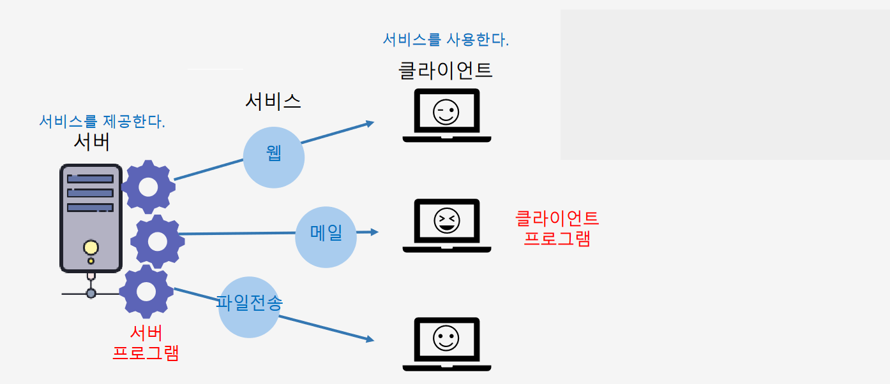
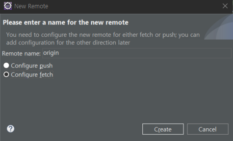
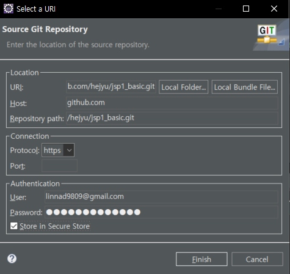

# `HTTP` `JSP` `Servlet` 수업 내용


## 서버-클라이언트

- 웹서버: 정적 HTML 페이지 요청에 응답하기 위한 서버
- 웹애플리케이션 서버: 정적 HTML 페이지 + 동적인 요청(DB 서버 사용자 조회, 저장 등)에 응답 가능한 서버

### HTTP 프로토콜
- 에러 코드
    - HTTP Status 404 – Not Found : 서버 url 을 찾을 수 없을 때 발생
        
        **에러 원인**
        1. 권한 부족 
        2. 서버 자체에서 오류가 발생한 경우 리소스 반환이 안되는 경우
        3. 리다이렉션(페이지 이동 설정) 오류
        4. 리소스가 서버에 존재하지 않는 경우
        5. URL 오류 : 오타, directory 파일 이름 등 확인 


### 동적 웹애플리케이션의 구조



### 개발환경 Eclipse 셋팅

1. 작업 공간 workspace 생성
2. 이클립스 실행: eclipse.exe
    - 이클립스 인코딩: ISO-10646/Unicode(UTF-8) 셋팅
        - Window > Preference > General > Workspace
        - Window > Preference > Web: HTML, CSS, JSP Files
3. 웹 애플리케이션 서버(WAS) 설정 순서
    - Apache Tomcat 9.0 추가
        1. WAS 생성하는 순서
            1. Server 뷰(View)로 가기
            2. 새 서버 추가: 마우스 오른쪽 버튼 클릭 > New > Server
            3. 서버 유형 선택: 'Server type' 서버 타입 선택 창 > Apache 카테고리 선택 > Tomcat v9.0 Server 선택 > Next 클릭
            4. 서버 실행환경 셋팅
                - Server's host name: 웹애플리케이션을 테스트하기 위한 주소를 입력 ex) localhost
                - Server name: 식별 가능한 서버의 이름을 입력
                - Server location: Apache Tomcat 설치 경로를 설정
                    - JRE(Java Runtime Environment) 선택: 서버가 사용할 JRE를 선택 (보통 이클립스 기본 JRE 선택)
            5. 서버 추가 완료
            6. 웹애플리케이션 서버(Apache Tomcat) 실행
                - Server 뷰 > 서버 선택 > 'Start the server' 버튼을 클릭
            7. 실행 중인 웹애플리케이션 확인
                - 브라우저 > 'http://localhost:포트번호/' 접속
                - Apache Tomcat 서버에서 실행 중인 웹 애플리케이션 확인


### `lombok.jar` 실행 파일 경로 Eclipse 에 셋팅 
1. 프로젝트 directory 마우스 오른쪽 클릭 > Build Path > Configure Build Path
2. Libriaries 창 Modulepath, Classpath 중 Classpath 선택

    **Classpath 와 Modulepath 개념** 
    - Modulepath : 무조건 하나의 모듈(`프로젝트`)에
    - Classpath : 


4. 서버를 사용하는 동적 웹프로젝트 생성
                    
    **현재 perspective(상단 우측 아이콘) 가 Java EE 상태인지 확인**

    1. File > New > Dynamic Web Project 클릭 
    2. Project name : 프로젝트 이름 입력

5. 데이터베이스 연결

    **Perspective : Data Source Explorer**

    1. Database Connection > New 클릭 > Connection Profile : Oracle 선택
        - database name : websecurity
        - describe 입력 선택
    2. Driver Profile / Connection Detail : 드라이버 추가 (아이콘) 클릭
        - Name/Type : Oracle 11 
        - Jar List : 기존 ojdbc 제거 > ojdbc11.jar 추가 
        - Properties
            - Database Name : xe
            - password : 1234
            - User Id : c##idev
            - Host : localhost
    3. Test Connection 클릭


### git 관리
1. git init
2. git add 파일선택 : Staged
    - gitignore 파일 작성
3. git remote add origin 개인-Repository-Url

### git 연동 
1. directory 마우스 오른쪽 클릭 > Team > Share Project
2. git init : git 저장소 초기화  > Create Repository 클릭 > Finish
3. https://github.com/  New Repository 사용할 저장소 만들기
4. 이클립스 git Prespective 이동 > 프로젝트 선택 > Remotes 디렉토리 선택 마우스 오른쪽 클릭 > Create Remote > 





password : 발급받은 토큰 입력



    


### 동적 웹 프로젝트 폴더 구조
    src >   main  > java : java 파일
            webapp : html, css, js, jsp 파일, 외부 라이브러리(jar)   
                ㄴ 정적 자원 : html,css, js, 이미지   => assets 폴더에 저장 
                ㄴ 동적 자원 : jsp   
                ㄴ 웹용 라이브러리 : WEB-INF > lib => ojdbc.jar, lombok.jar

### JSP (Java Server Page)
- 발전 순서 : applet(애블릿) > servlet(서블릿) > JSP
- html 파일에 필요한 부분에만 자바를 쓸 수 있고 변수 출력 등을 출력할 수 있다  
- <% %> : 자바 코드 작성 할 수 있는 태그  
- `request` `response` `session` `out` 객체 제공 

#### HTTP 요청 파라미터 전달

#### JSP 파일의 형식

#### JSTL 태그(반복, 조건, 서식, 함수)

#### 애트리뷰트와 EL

#### request 객체의 속성값 
    - 요청 URL
    - Context Path
    - 서버와 클라이언트
    - ip

#### 서블릿 클래스의 형식

#### forward : 서버측에서 웹페이지 전환하기 
    - 사용자 요청을 전달하므로 애트리뷰트 값을 jsp 로 보낼 수 있음.
    - forward 에서 사용한 객체 RequestDispatcher : jsp의 pageContext 역할

#### Redirect : 서버측에서 클라이언트가 다른 url을 재요청하도록 함

#### 요청 방식(메소드) GET 과 POST 

#### 애트리뷰트 : 서버에서 저장하는 Object 타입 데이터
- 스콥(Scope) , 사용 범위가 있습니다.
- 우리가 사용해 본 스콥 2개 : 현재 웹페이지(pageContext), 요청(request)
- 저장은 스콥객체.setAttribute()
- 읽기는 스콥객체.getAttribute()


### 서블릿 Servlet

- 서버에서 실행되다가 웹 브라우저에서 요청을 하면 해당 기능을 수행한 후 웹 브라우저에 결과를 전송(응답)하는데, 이러한 역할을 수행하는 자바 클래스

- 일반 자바 파일과는 다르게 자바 컴파일러만으로 실행되지 못하고 톹캣과 같은 Jsp / Servlet 컨테이너에서 실행된다 


### 서블릿 (Servlet) 클래스 

- 만드는 법
    - javax.servlet.http.`HttpServlet` 을 상속한다
- 특징 
    - 연결되는 url이 반드시 있다
        - url 이름은 중복되어선 안된다
        - 방법1) 애노테이션 사용  : @WebServlet(urlPatterns = {배열})
        - 방법2) web.xml 에서 servlet 태그로 설정하기
    - `HttpServletRequest` request : 요청  
    - `HttpServletResponse` response : 응답

    - jsp가 기본제공하는 객체는 요청,  응답 외에는 서블릿에서 직접 선언해서 사용합니다.
    - session : `HttpSession` 객체로 선언
    - out : `PrintWriter` 객체로 선언
- `HttpServletRequest 메소드`
    - request.getRequestDispatcher("URI")
    
    - request.setAttribute("뷰에서 받을 이름",자료형)

### 서블릿 생명주기(Life Cycle)
- init() : 메모리에 없을 때 요청을 받았다면 초기화 메소드로 가장 먼저 실행 됩니다.
- service() 
    - 요청이 있으면 실행되는 메소드
    - GET과 POST 모두 처리하며
	- service()메소드가 구현한 내용이 실행되면
        (HttpServlet @Ovirried 재정의 메소드로 정의되어 있으면)
        doGet() 또는 doPost()는 실행이 안됩니다.
- doGet() : Get 요청일 때 실행하는 메소드.
- doPost() : POST 요청일 때 실행하는 메소드
- destroy() : 메모리에서 서블릿이 제거가 될때 실행되는 메소드
- 일반적으로 service() 만 사용하거나 또는 doGet() 과 doPost() 만 사용합니다.


|서블릿|기능|요청메소드|서블릿 코드|응답JSP|
|---|---|---|---|---|
|CustomerServlet.java|고객전체조회|GET|dispatcher.forward(req, resp)|customers.jsp|
|ProductServlet.java|상품전체조회|GET|dispatcher.forward(req, resp)|products.jsp|
|BuyServlet.java|주문전체조회|GET|dispatcher.forward(req, resp)|buys.jsp|
|Register.java|고객등록-화면|GET|dispatcher.forward(req, resp)|register.jsp|
|Register.java|고객등록-저장|POST|response.sendRedirecct(url)|X, url 필요|
|ProductRegister.java|상품등록-화면|GET|dispatcher.forward(req, resp)|productReg.jsp|
|ProductRegister.java|상품등록-저장|POST|response.sendRedirecct(url)|X, url 필요|


### Mybatis Framework 마이티스 프레임워크
- 자바코드와 관계형 데이터베이스가 상호작용 하는 방식을 관리하는데 도움을 주는 `자바 프레임워크`
- JDBC로 처리하는 코드와 파라미터 설정과 결과 코드를 대신 처리해준다.
- XML : Markup 언어, 태그를 사용하는 언어, 
HTML과 같이 태그를 사용하면서 데이터를 저장한다.
- 설정, 데이터 저장 목적으로 사용된다
- ex)  톰캣의 서버 port 설정은 결국은 server.xml 파일 내용

- `mybatis-config.xml`  : 데이터베이스 접속 환경 설정파일
    
    1) environments : 데이터베이스 Connection 환경셋팅
    ```xml
        <!-- 데이터베이스 서버 배포 개발, 테스트, 프로덕션 환경  설정-->
        <!--  -->
        <properties resource="mybatis/db.properties"/>

        <environments default="development"> 
            <environment id="development"> 
                <transactionManager type="JDBC"/>
                    <dataSource type="POOLED"> 
                        <property name="driver" value="${driver}"/>
                        <property name="url" value="${url}"/>
                        <property name="username" value="${username}"/>
                        <property name="password" value="${password}"/>
                    </dataSource>
            </environment>
        </environments>
    ```

    2) typeAliases : 마이바티스 SQL xml 파일 사용 `Object파일경로`, `사용할 별칭` 셋팅 
    ```xml
        <!-- 타입 별칭 설정하기 -->
        <!-- type = "Object 위치"  alias="사용할 별칭"-->
        <typeAliases>
                <typeAlias type="day4.mybatis.dto.BuyDto" alias="BuyDto"/>
                <typeAlias type="day4.mybatis.dto.CustomerDto" alias="CustomerDto"/>
                <typeAlias type="day4.mybatis.dto.ProductDto" alias="ProductDto"/>
                <typeAlias type="day4.mybatis.dto.CustomerBuyDto" alias="CustomerBuyDto"/>
        </typeAliases>
    ```
 
    3) mappers : 마이바티스 Mapper XML 위치 설정
    ```xml
        <mappers>
            <mapper resource="mybatis/buys.xml"/>
            <mapper resource="mybatis/customer.xml"/>
            <mapper resource="mybatis/product.xml"/>
        </mappers>
    ```
 - `SqlSessionBean.java` :  `mybatis-config.xml` 파일을 불러와 SQL xml 파일 읽어오는 파일

    ```java
    /*
    * Mybatis 라이브러리 기본 제공 객체
    *  - SqlSession : 데이터베이스 세션을 생성하는 객체 
    */
    public class SqlSessionBean {

        public static SqlSessionFactory sqlSessionFactory;

        static {
            String resource = "mybatis/mybatis-config.xml";     //mybatis 설정파일
            InputStream inputStream=null;			            //파일을 읽기위한 입력 스트림
        
            try {
                inputStream = Resources.getResourceAsStream(resource);   //리소스 파일 자원 읽어옴
            }catch(IOException e) {
                System.out.println("mybatis 설정 파일 읽기 오류입니다.");
            }
            sqlSessionFactory = new SqlSessionFactoryBuilder().build(inputStream);   

        }
        
        // SqlSessionFactory 객체 
        // :dao에 필요한 Connection, PreparedStatement 자원 생성
        public static SqlSessionFactory getSessionFactory() {    
            return sqlSessionFactory;
        }
    }
    ```


