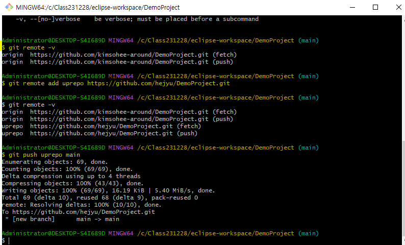
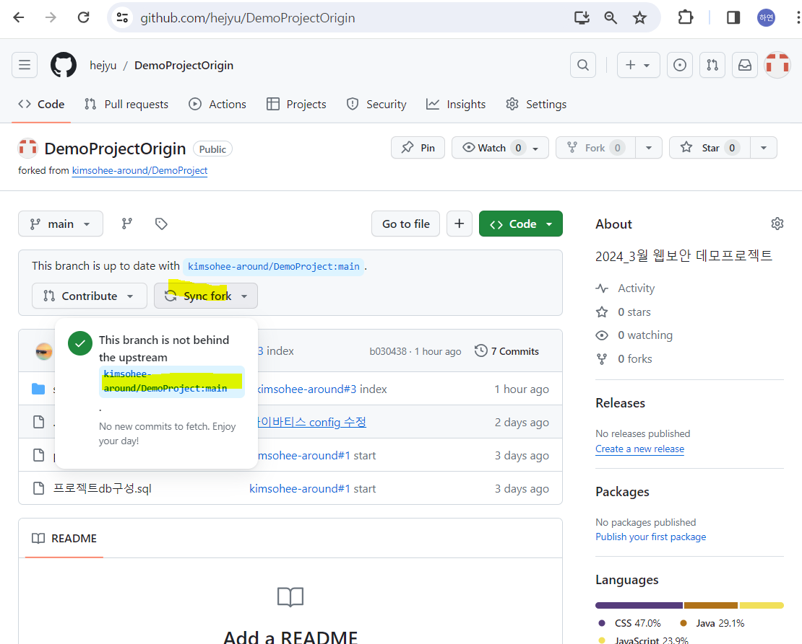
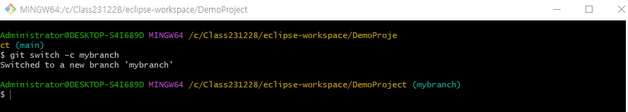
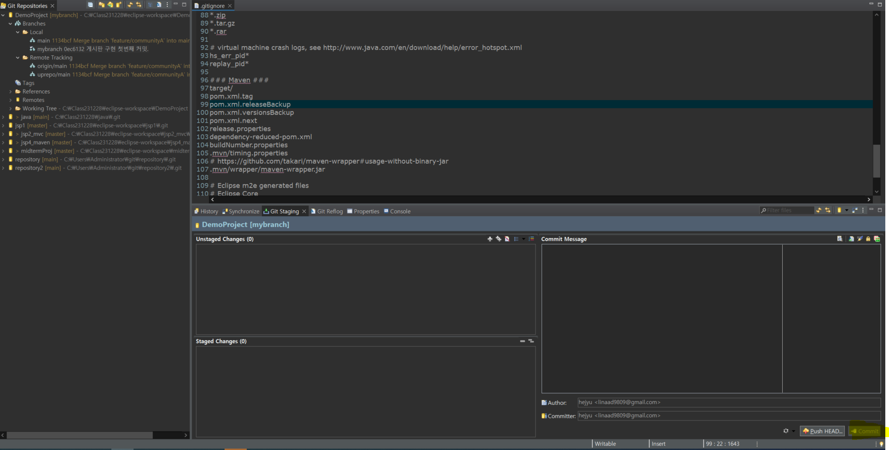
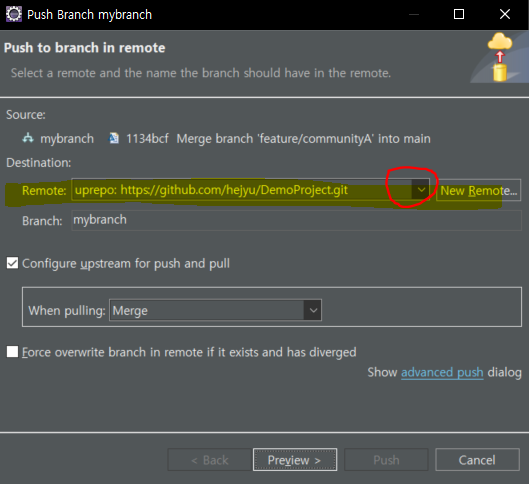
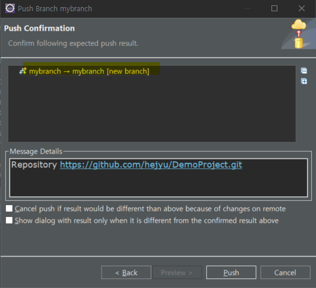
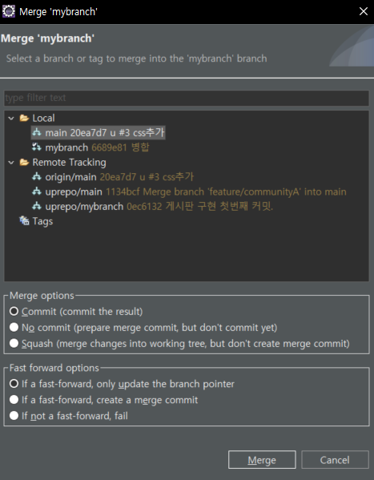
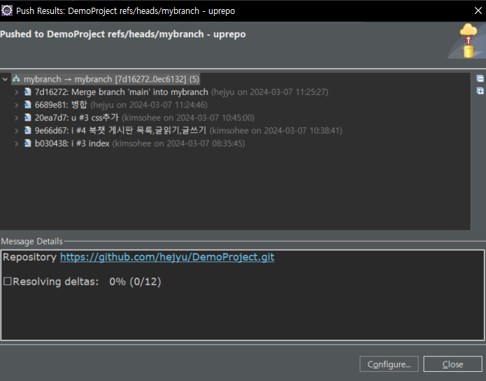

# 중고도서 북챗 - `JSP` `Servlet` `Maven` `비동기REST-API`


## 1. 데이터 준비


## 2. 로컬 작업디렉토리 생성
- **git clone : https://github.com/kimsohee-around/DemoProject.git**   
1. git perspective 이동 > 초록색 아이콘 클릭 
1. DemoProject 디렉토리 선택 > WorkingTree 우클릭 > Import Project

## 3. 프로젝트 개발 환경 셋팅
- **톰캣 서버 추가**
1. Build Path > Libraries > Classpath > Add Library ... > Server Runtime 추가

- **Team - Fetch from origin**
    - 변경점을 확인한다

- **Team - Pull**
    - 프로젝트를 업데이트

## 4. 소스 분석
### 1. List Controller 

**파라미터 GET**

- 어떤 메뉴 또는 링크로 전달되는지?
- 어떤 값인지 ?
    request.getParameter('page') : 페이지 번호 
    파라미터 page 가 없을 때 기본값 1 
    **1. header.jsp 38번줄 링크로 list.jsp 페이지로 전환**

    **2. read.jsp 67번줄 링크로 파라미터 page 전달**

    **3. write.jsp 43번줄 링크로 파라미터 page 전달**

    **4. list.jsp 106번,109번,114번,118번,121번 링크로 파라미터 page 전달**


**애트리뷰트(request scope)**
- list : 페이징 목록
- paging : 페이지 목록(현재페이지번호, 전체글수, 페이지 글 개수...) 
- today : 현재날짜시간 list.jsp 62번줄에서 사용함

### 2. Read Controller

**파라미터 GET**

- 어떤 메뉴 또는 링크로 전달되는지?
- 어떤 값인지 ?

    request.getParameter('idx') : 요청글 idx 값 
    request.getParameter('page') : 요청글 페이지 위치 

    **북챗 메뉴 list.jsp에 47번줄에서 /couuminty/read?idx= &page= 링크로 파라미터 `idx : 글번호`, `page : 현재페이지` 전달**

**애트리뷰트(request scope)**
- vo :  선택된 idx(메인글 글번호)로 조회한 글을 가져온 글 객체(글제목, 내용, 작성자, 작성날짜 포함)
- cmtlist : 선택된
 idx의 댓글
- page : 파라미터로 받은 현재 페이지번호


### 3. Write Controller 

**파라미터 GET**

- 어떤 메뉴 또는 링크로 전달되는지?
- 어떤 값인지 ? 

    request.getParameter('page') : 요청글 페이지 위치 

    **북챗메뉴 list.jsp 95번줄에서 /couuminty/write?page= 링크로 파라미터 `page` 전달**


**애트리뷰트(request scope)**
- page : 파라미터로 받은 현재 페이지번호


### 4. Member Service

**java security. MessageDigest : sha256 해시함수 제공 API**

- 암호화 : 평문 -> 알고리즘 -> 암호문(가독X)
- 복호화 : 암호문 -> 알고리즘 -> 평문
- 해싱 : 평문 -> 해싱함수로 이동 -> 같은 평문에 대해 가독불가능 같은 문자열(암호문). 암호화된 문자열이 다시 평문으로 복구는 못한다.
- 해싱 함수 
    - sha256 해싱함수 : 암호문 문자열을 256비트 16진수 64개문자로 만든다.

    ```java
    public String encrypt(String text) throws NoSuchAlgorithmException {

        // 1.실행 객체 생성
        MessageDigest md = MessageDigest.getInstance("SHA-256");
        // 2. 평문을 저장
        md.update(text.getBytes());
        // md.digest() 메소드가 해싱함수를 실행한다. 해싱 결과가 buyte[]

        return bytesToHex(md.digest());
    }

    private String bytesToHex(byte[] bytes) {
        StringBuilder builder = new StringBuilder();
        for (byte b : bytes) {
            // 바이트 배열에서 1 바이트씩 가져와 16진수 2자리 문자로 변환
            builder.append(String.format("%02x", b));
        }
        return builder.toString();
    }

    ```
#### 용도 : 비밀번호 암호화에 사용

### 5. LoginActionController 
`Session, 브라우저, Cookie`

- 인가(권한이 있는지-글작성, 댓글작성)을 확인
- 인증 (로그인-사용자확인)

**사용자 브라우저가 서버 http://localhost:8088/DemoProject url로 처음 요청을 보내면 톰캣은 이 브라우저를 식별하기 위해서 JSESSONID 값을 생성하고 (JESSIONID, 생성값) 한쌍을 브라우저 쿠키 저장소에 저장하도록 응답을 보낸다.
그 이후에는 사용자가 브라우저가 동일한 URL로 요청을 보낼때 마다,
JSESSIONID 값을 함께 서버로 보낸다. 서버는 JSESSIONID 값이 같으면 동일 
세션이라고 취급을 한다.
애트리뷰트를 SESSION SCOPE에 저장하면, `JSESSIONID 값이 같은 동안`에는
애트리뷰트 값이 유지가 된다. (아주 중요!)**

**브라우저의 Application - Local Strorage와 Session storage는 브라우저에 저장하는 값들이고 session 애트리뷰트는 서버에 저장하는 값들이다.**

1. 인증 (로그인 사용자 확인)
    ```java
    // LoginActionController.java
    if(user != null) {		
        // 사용자 확인 성공
        // 사용자 정보를 서버의 세션 저장소에 저장
        session.setAttribute("user",user);  //핵심.
        url =  request.getContextPath();
    } else {
        // 사용자 확인 실패
        Cookie cookie = new Cookie("incorrect","y");
        cookie.setPath("/");		//쿠키 저장 경로

        response.addCookie(cookie); //로그인 요청 응답으로 브라우저의 쿠키를 보낸다. (브라우저는 애플리케이션 쿠키 스토리지에 쿠키를 저장)
        url="login"; 
    }

    ```
    **로그인 실패시 login.jsp 스크립트 안에서 Cookie 삭제 만료기한을 줘서 쿠키를 바로 사라지게 한다.**
    ```javascript
    // login.jsp
    // 쿠키에 저장된 로그인 실패 정보 확인. el에 쿠키 객체 cookie가 지원되므로 해당 쿠키 이름 지정하여 사용합니다.
    console.log('${cookie.incorrect}')
    if('${cookie.incorrect.value}'==='y') {
        document.getElementById('incorrect').style.display='inline-block';
        /* 쿠키삭제 */
        document.cookie = 'incorrect' + "=; expires=Thu, 01 Jan 1970 00:00:10 GMT; path=/;";
    }
    console.log('incorrect','${cookie.incorrect.value}')
    ```

    ```javascript
    // list.jsp
    let yn
    // 로그인 후 저장된 세션 애트리뷰트 url
    if('${user.userid}'==''){
        yn=confirm('글쓰기는 로그인이 필요합니다. 로그인 하시겠습니까?')
        /* 로그인 후 글쓰기로 돌아가기 */
        if(yn) {
            // 로그인 후 글쓰기 화면 다시 요청하기 위해 url을 브라우저에 저장하기
            sessionStorage.setItem('back', './community/write');
            // 

            location.href='../login'  
        }
    }else{
        location.href='write?page=${paging.currentPage }'
    }
    ```
    ```java
    // LoginViewController.java
    
    ```
    ```javascript
    // index.jsp

    ```
    ```jsp
    <!-- write.jsp 글쓰기 페이지로 이동됨. -->
    header.jsp
    <-- sessionScope.user는 user로만 써도됨. 
    sessionScope는 명시적으로 user가 session 애트리뷰트라고 지정해주는 표현이다. -->
    <c:if test="${sessionScope.user == null }">		
        <li><a href="${pageContext.request.contextPath }/join"><span>회원가입</span></a></li>
        <li><a href="${pageContext.request.contextPath }/login">로그인</a></li>
    </c:if>	

    ```


------
## 6. 파일 업로드 구현에 필요한 내용

1. 사용자가 파일을 업로드할 기본적인 폼을 만듭니다.
- 단, 폼을 만들시에 주의해야 할 점이 있다.
    1. form을 만들 시에 반드시 method="post" 로 지정하기
    1. from 태그 안에 enctype="multipart/form-data" 라는 코드 넣어주기
    1. 파일을 업로드 할 수 있게 해주는 `<input type="file">` 을 사용해주기

2. 사용자가 업로드 한 파일이 저장될 폴더를 파일시스템에 만듭니다.
- "upload"라는 폴더가 파일 시스템에 없다면 새로 만들어줍니다.

3. MultipartRequest 객체 사용을 위해서 먼저 cos.jar 라이브러리를 다운받아야 합니다.
- 그 다음, MultipartRequest multi = new MultipartRequest(request,path,maxSize,"UTF-8", new DefaultFileRenamePolicy()); 코드를 입력하는데, 이 코드는 폼에서 전달한 파일은 request 형식으로 받고, 업로드 폴더 안에 넣어주는 작업입니다.

- MultipartRequest를 사용할 떄 또한 주의해야할 점이 있는데, MultipartRequest를 사용하게 되면 multi.getParameter();를 통해서 값을 받아와야만 합니다.


4. 업로드 파일의 경로를 임의로 지정하고 싶은 경우 톰캣 server.xml 파일을 열어
`<Context docBase="C:/Class231228/upload" path="/upload" />` 코드를 작성해줍니다.
그러면 서버로 전달받고 있는 jsp 파일에서 파일시스템 docBase 경로에 있는 파일들을 jsp 파일에서 upload라는 별칭으로 사용할 수 있습니다.
`` 


## 7. toss 간편결제 API 사용 메뉴얼 
0. 토스 개발자센터 회원가입 
1. JSP 중고도서 아이템 요소 이벤트에서 API 서버로 UI출력 결제요청 호출
- **결제위젯 함수로 `클라이언트 키`, `커스터머 키` 전달**
    
    - `클라이언트 키` : 브라우저에 결제창을 띄우는데 사용합니다. 
    - `커스터머 키` : 구매자 ID 입니다. 유추가 가능한 사용자 아이디나 전화번호 같은 값은 안전하지 않습니다. 
- 결제창으로 판매자의 중고도서 정보를 보냅니다.    
- **간편결제 핵심 메소드**
    
    1. `const paymentWidget = PaymentWidget(clientKey, customerKey) `
     - **브라우저에 간편 결제 UI를 출력**

    2. `paymentWidget.renderPaymentMethods(셀렉터, 금액, 옵션)
`    
    - **금액 정보 결제 UI에 랜더링**
    - `updateAmount(결제 금액)` : 할인, 포인트 차감 등으로 변경된 결제 금액을 UI에 업데이트합니다.

    3. `paymentWidget.requestPayment(payObj)`
    - **파라미터**
    - `successUrl`  : **결제가 성공하면 리다이렉트되는 URL입니다. 결제 승인 처리에 필요한 값들이 쿼리 파라미터로 함께 전달됩니다. 반드시 오리진을 포함해야 합니다. 예를 들면 https://www.example.com/success와 같은 형태입니다.**
        
        ```javascript
        const payObj = {
            orderId: obj.bcode +'_' + orderid,            
            orderName: obj.title,                 
            successUrl: window.location.origin + "/DemoProject/pay/success",  
            failUrl: window.location.origin + "/DemoProject/pay/fail",        
            customerName: obj.saleuser
        }
        
        console.log(payObj)
        button.addEventListener("click", function () {
        paymentWidget.requestPayment(payObj)
        })
        ```

    
    
2. 결제창을 이용하여 정상적으로 결제가 완료되고,
성공 시 콜백 URL로 `orderId, paymentKey, amount, paymentType` 4개의 파라미터 값이 넘어옵니다.

- `BookCasePayRequestSuccessController.java`

- `paymentKey` :  결제를 식별하는 키 값입니다. 토스페이먼츠에서 발급합니다. 결제 승인, 결제 조회, 결제 취소 등 운영에 필요한 값입니다.
 

## 8. Filter 필터 - `SessionFilter` `SetEncodingFilter`
필터는 WAS가 동적 요청을 처리하는 컨트롤러 서블릿에게
request 를 전달하기 전에 요청을 검사(확인,로그) 하기 위해 실행되는 서블릿입니다.
그리고
response를 브라우저에게 전달하기 전에 응답을 검사(확인,로그)하기 위해
실행됩니다.
즉, 사용자 요청과 컨트롤러 사이에 있으며 
여러 개 필터가 동작할 수 있어서 체인으로 구성된다고 말합니다.

필터는 애노테이션 또는 web.xml에서
설정하는데 데모프로젝트에서는 web.xml에서 정의했습니다.


-  `WAS  request` : 클라이언트의 요청이 올 때 

   

    **1. web.xml**

    ```xml
    <!-- Filter 2개 적용 -->
    <!-- 필터 등록 -->
    <filter>
        <filter-name>SessionFilter</filter-name>  <!-- name은 식별값  -->
        <filter-class>org.iclass.filter.SessionFilter</filter-class>  <!-- 필터의 패키지명.클래스명 -->
    </filter>
    <filter>
        <filter-name>SetEncodingFilter</filter-name> 
        <filter-class>org.iclass.filter.SetEncodingFilter</filter-class>
    </filter>
    <!-- 필터 매핑 -->
    <filter-mapping>
        <filter-name>SessionFilter</filter-name>
        <url-pattern>/*</url-pattern>  <!-- 모든 url에 적용 -->
    </filter-mapping>
    <filter-mapping>
        <filter-name>SetEncodingFilter</filter-name>
        <url-pattern>/*</url-pattern>
    </filter-mapping>
    ```


    **2. SessionFilter**

    **3. SetEncodingFilter**

    **4. FrontController**

    **5. URL 맵핑된 Controller**

-  `response WAS` : 클라이언트로 응답을 줄 때

    **1. URL 맵핑된 Controller**


    **2. FrontController**

    **3. SetEncodingFilter**

    **4. SessionFilter**


---

## 자신의 git Repository로 fork 저장소 push하는 법
    
1. DemoProejct 디렉토리 우클릭 > Open git bash Here

1. git remote -v 
    - 연결된 git 저장소 확인
    
1. git remote add uprepo https://github.com/hejyu/DemoProject.git 
    - uprepo 저장소로 현재 git 주소를 자신의 git 주소로 연결

1. git remote -v
    - 자신의 git 저장소 추가된 것 확인 

1. git push uprepo main
    - uprepo 저장소의 main 브랜치로 프로젝트 푸쉬

    


## `git Fork` :  다른 사람 git repository 저장소를 내 저장소로 가져오는 것
- 저장소가 내 저장소로 동기화 된다.

1. git 저장소 - Fork 클릭
- 저장소이름 입력 > Create

    


## git `브랜치` 생성(create), 병합(merge)

### 생성(create)
- git bash에서 추가하기

    1. 프로젝트 디렉토리 우클릭 > open git bash here 
    - `git switch -c mybranch` : mybranch 라는 이름으로 브랜치를 생성하고 현재 브랜치를 mybranch로 변경한다
    

- Eclipse git perspective에서 추가하기
    1. Branches > Local : 마우스 우클릭 > Switch to > New Branch..

**브랜치 용도**
- `main : pull만 받는 용도`
- `mybranch : 로컬에서 테스트하는 용도, 주석은 따로 메모장 만들어서 작성`

### mybranch 소스 수정 후 mybranch로 커밋하는 법

1. 커밋할 소스 Stage하고 `Commit만` 진행. 
    
    

1. Branch - Local - `mybranch` 마우스 우클릭 >  `Push Branch`

    

1. Remote : 자신의 저장소로 변경 후 Preview 클릭 > mybranch 브랜치로 푸쉬 확인

    


### 브랜치 이동 : `main 브랜치 선택 > checkout` 

1. 디렉토리 우클릭 - Fetch from origin

1. 디렉토리 우클릭 - Pull..


## 병합(Merge) : 브랜치와 브랜치를 합침
### main 에서 pull 받고 mybranch에 합치기

1. `mybranch`로 `체크아웃`한다.

    **stash 한 파일이 체크아웃 하면서 날라간경우 (원복 후의 충돌 라인을 수정이 발생할 수 있다.**

1. `mybranch`에서 `Merge` 클릭

    
    ---
    **충돌 파일 발생하는 경우 해결 방법**
    1. `Git Staging 뷰로 이동` > 충돌 파일 선택
    1. `>>> Head 변경점 라인만 남기고 소스 삭제`
    1. `import 다 지우고, ctrl+shift+o import 다시 불러오기`
    1. `오류 없으면 커밋만 클릭`
    1. `mybrach 브랜치 확인하고 Push Head... 클릭`(**3. `디렉토리` > `Push to uprepo` 클릭와 같음.**)
    ---


1. `디렉토리` > `Push to uprepo` 클릭


**테스트하는 코드는 항상 이 순서를 거쳐서 mybranch에서만 작업합니다.**  

1. mybranch를 main에 합치기


